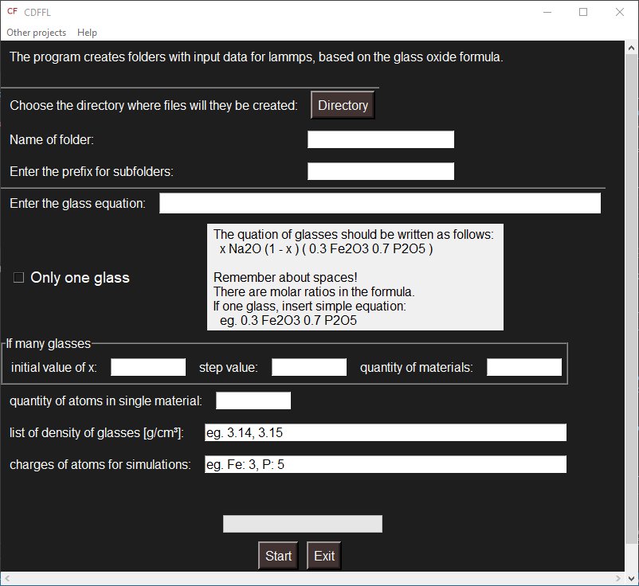

# CDFFL-Create-data-files-for-lammps-amorphous-simulations

## Description 
CDFFL application creates folders with starting data with random position of the atoms in files for Lammps (https://www.lammps.org/) simulations.  You only need to enter the oxide formula of the material. Useful for simulating glasses and amorphous materials.



## Usage 
If you use CDFFL.exe for widows run program CDFFL.exe in folder. Complete the form and run application by `<Start>` button. Folders with data will appear in the previously chosen directory. Now you can add your starting data created by CDFFL (your_starting_data.txt) to your Lammps script e.g.:

```
atom_style	charge
dimension 	3
boundary	p p p

read_data	your_starting_data.txt #your starting data
```
In file  ```atoms_id.txt``` created by CDFFL you have ids for atoms in the equation entered in the program. 

If you are going to use the python interpreter, copy the repository and run user_GUI.py in the main folder. E.g .:

``` 
python user_GUI.py
```
or
``` 
python -m user_GUI.py
```

## Technologies/Tools

1. Python 3.9 
2. tkinter 
3. Python Standard Library modules 

## Tests 
I use Test-driven development technique for develope this program. You can find unit and GUI tests in test folder on Test and Dev branch. 

**Tools:** 
1. **pytest**
2. **allure** - for create raport 
3. **appium** with **WinAppDriver** - for GUI test 
4. **numpy** and **pandas** - for data preparation
